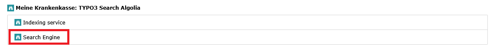
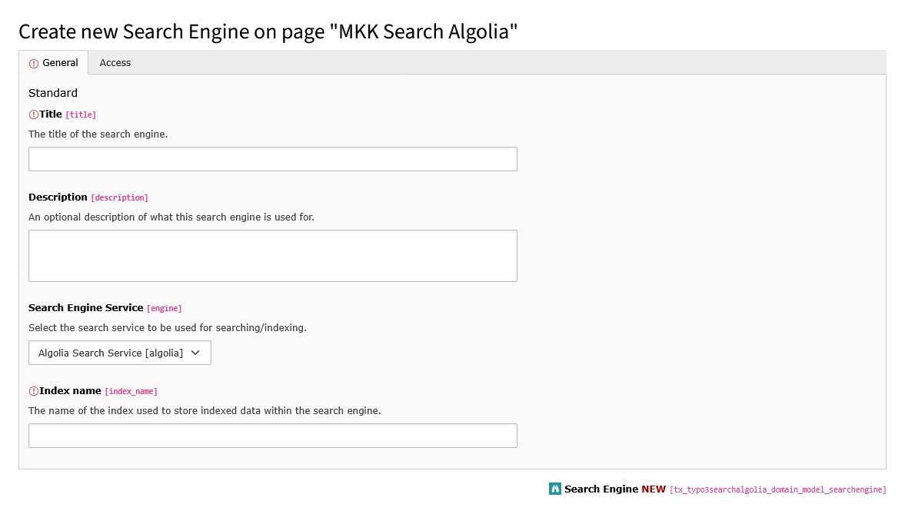
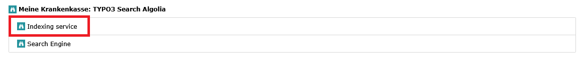
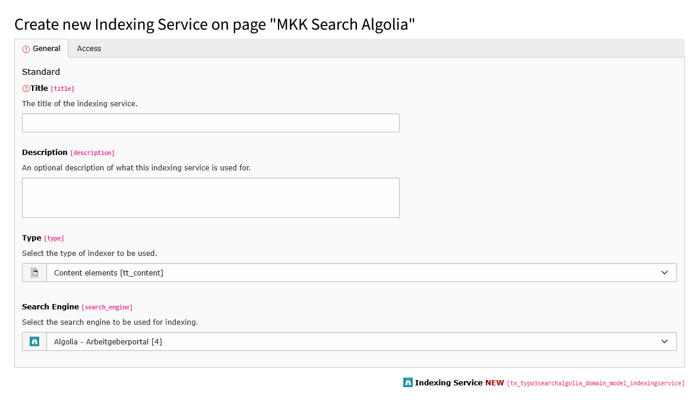

# Configuration

## Update database structure

Use the "Analyze Database Structure" in the "Maintenance" Admin Tools section to update the database structure.

## Web service

### API endpoint

To access the Algolia API, store the corresponding configuration in the file `additional.php` within the
global structure "TYPO3_CONF_VARS" under "EXTENSIONS" and "typo3_search_algolia" (note the spelling) of your TYPO3
installation.

```php
// The universal messenger API endpoint
$GLOBALS['TYPO3_CONF_VARS']['EXTENSIONS']['typo3_search_algolia'] = array_merge( 
    $GLOBALS['TYPO3_CONF_VARS']['EXTENSIONS']['typo3_search_algolia'] ?? [], 
    [ 
        'appId' => 'YOUR-APP-ID', 
        'apiKey' => 'YOUR-API-KEY', 
    ]
);
```

| Field  | Description                                                                                                                                                     |
|:-------|:----------------------------------------------------------------------------------------------------------------------------------------------------------------|
| appId  | Your Algolia application ID.                                                                                                                                    |
| apiKey | An API key with the necessary permissions to make the request. The required access control list (ACL) to make a request is listed in each endpoint's reference. |

You can find your application ID and API key in the Algolia dashboard.

## Basics

Next, create a data directory to store the configured index services, search engines, and, if applicable, file
collections. To do this, switch to the list view in the TYPO3 backend and add a new "Folder" element to the page tree,
then select the created data folder.

## Setting up index services and search engine

### Search engine

Create a new record of type "Search Engine".



*Fig. 1: Create a new record of type "Search Engine"*

Add a title, an optional description to the new record, and select the search engine service to use (the default
available one is "Algolia Search Service"). To create a custom search engine service, refer
to: [Custom Search Engine](CustomSearchEngine.md)

Add a search engine dependent configuration into the "index_name" field. In the case of Algolia searches, this is the
name of an index within Algolia in which the indexed data will ultimately be stored.



*Fig. 2: Configuration TCA of type "Search Engine"*

### Indexing Service

In the next step, the respective indexing services are created. These define which data will be indexed.

To do this, create a new record of type "Indexing Service".



*Fig. 3: Create a new record of type "Indexing Service"*

Give the indexing service a meaningful title, an optional description, and select the type of indexer to be used. By
default, the following are available:

- Content elements
- Pages
- Messages
- Files

The display updates depending on your selection and offers additional configuration options.

Then select one of the previously created search engine configurations.



*Fig. 4: Configuration TCA of type "Indexing Service"*

#### Page Indexer Configuration

The following additional options are available for the page indexer:

- Include content elements [include_content_elements]
    - Enable this option to index the page's content elements in addition to the page properties. Alternatively, you can
      use the content element indexer, especially if the search engine has a record size limit.
    - With this option, the content element fields stored in the [TypoScript configuration ](ContentElementIndexer.md#custom-fields)
      `module.tx_typo3searchalgolia.indexer.tt_content.fields` are read and stored directly in the page's index entry in
      the `content` attribute. A separate indexing service for the content elements is then no longer necessary.
      However, a data set for a page can become very large, so it's important to check whether the search engine
      supports this.

- Page type [pages_doktype]
    - Select the page types by which the pages selected below for indexing should be filtered. If no selection is made
      here, all page types will be included.

- Single pages [pages_single]
    - Select individual pages to be indexed here. Indexing will only occur for pages whose "Include in Search" option is
      enabled in the page properties.

- Pages (recursively) [pages_recursive]
    - Select the pages you want to recursively index, including all their subpages. Indexing will only occur for pages
      whose "Include in Search" option is enabled in the page properties.

#### Content Element Indexer Configuration

The following additional options are available for the content item indexer:

- Single pages [pages_single]
    - Select individual pages to be indexed here. Indexing will only occur for pages whose "Include in Search" option is
      enabled in the page properties.

- Pages (recursively) [pages_recursive]
    - Select the pages you want to recursively index, including all their subpages. Indexing will only occur for pages
      whose "Include in Search" option is enabled in the page properties.

#### File Indexer Configuration

The following additional options are available for the file indexer:

- File collections [file_collections]
    - Select the file collections that should be used for indexing. Indexing will only occur for files whose "Include in
      Search" option is enabled in the metadata properties.
