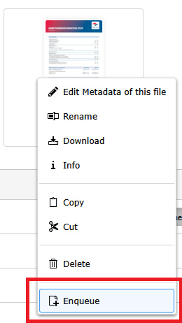

# File Indexer

The File Indexer is a powerful component of the TYPO3 Search Algolia extension that indexes files stored in TYPO3's File Abstraction Layer (FAL). It extracts metadata and content from files, making them searchable through Algolia. This is particularly useful for websites with document repositories, downloadable resources, or media libraries.

## How It Works

The File Indexer processes files based on the configuration in your indexing service. When triggered, it:

1. Retrieves files from the file collections specified in your configuration
2. Filters files based on their properties (file extension, no_search flag, etc.)
3. Extracts metadata from each file
4. For supported file types (currently PDF), extracts the actual content
5. Sends the processed data to Algolia for indexing

This allows users to search not only for file names and metadata but also for text contained within supported documents.

## File Properties

The "sys_file_metadata" table has been expanded to include the "no_search" field, which behaves identically to the
existing field in the "pages" table and, if set, allows a file to be excluded from indexing. By default, this field is
not set for all files, meaning they will be indexed.

To set the property, click on the desired file in the file list and switch to the new "Behavior" tab. Here you can
adjust the value for the "no_search" property accordingly.


*Fig. 1: Exclude file from indexing*

## Indexed Fields

### Standard Fields

In addition to the [standard fields](Indexers.md#standard-indexed-fields), the following fields are indexed by default
for files:

| Field     | Description                                                                           |
|-----------|---------------------------------------------------------------------------------------|
| extension | The file extension.                                                                   |
| mimeType  | The MIME type of the file.                                                            |
| name      | The name of the file.                                                                 |
| size      | The size of the file in bytes.                                                        |
| url       | The relative URL to the file (only included if available).                            |
| content   | The content of the file (only included for supported file types, currently only PDF). |

### Custom Fields

Additional fields to be indexed from the file metadata can be defined using the TypoScript configuration
module.tx_typo3searchalgolia.indexer.sys_file_metadata.fields. This is set by default as follows:

```typo3_typoscript
module {
    tx_typo3searchalgolia {
        indexer {
            sys_file_metadata {
                fields {
                    title = title
                    description = description
                    alternative = alternative
                    creator = author
                }

                # Comma-separated list of allowed file extensions
                extensions = pdf
            }
        }
    }
}
```

## Context menu

A single file can also be directly enqueued using the TYPO3 context menu in the file list:



*Fig. 2: Directly enqueue a file*

## Usage and Best Practices

### Supported File Types

Currently, the File Indexer fully supports:
- PDF files (including content extraction)
- Other file types (metadata only)

The supported file extensions can be configured in the TypoScript settings as shown in the Custom Fields section.

### Triggering File Indexing

Files are indexed when:
- The indexing is triggered through the backend module
- A file is directly enqueued via the context menu
- A scheduled task runs the indexing process

### Best Practices

1. **File Collections**: Organize your files into logical file collections to make indexing management easier. This allows you to selectively index different types of files for different purposes.

2. **Metadata Quality**: Ensure your files have proper metadata (title, description, etc.) as this significantly improves search quality. Well-described files are more likely to appear in relevant search results.

3. **File Size Considerations**: Be mindful of very large PDF files, as content extraction can be resource-intensive. Consider setting size limits for content extraction in custom implementations.

4. **File Extensions**: Only enable content extraction for file types that contain searchable text. Adding non-text file types to the extensions list won't provide useful search content.

5. **Security Awareness**: Remember that indexed file content becomes searchable. Ensure that sensitive documents are either excluded from indexing or properly access-restricted in your search implementation.
