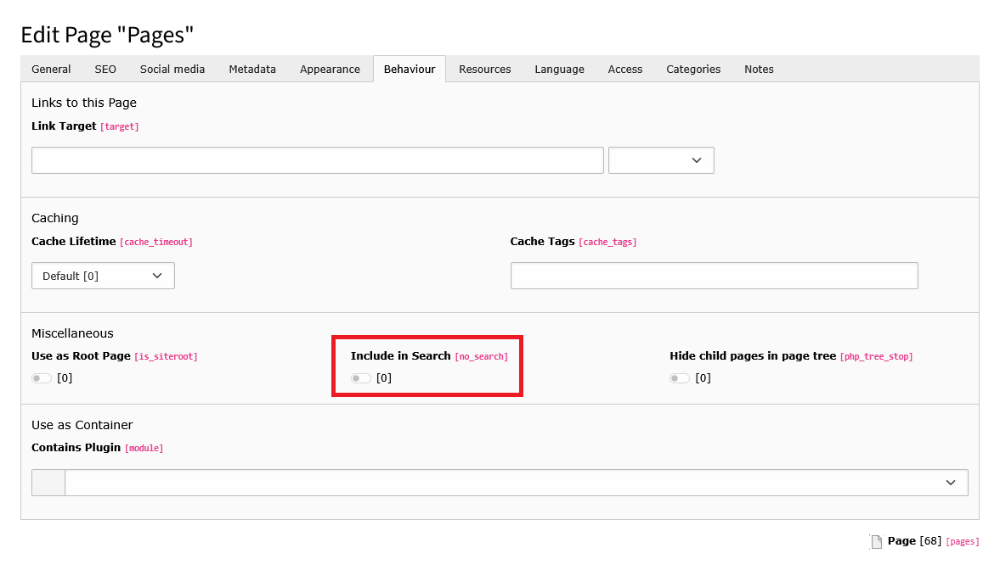

# Page Indexer

## Page Properties

Indexing depends on the page properties. Depending on the status of the page properties, the pages and/or subpages can
be indexed or not.

To actively exclude a page from indexing, deactivate the "no_search" property in the page properties. This is located in
the "Behavior" tab by default.



*Fig. 1: Exclude page from indexing*

## Indexed Fields

### Standard Fields

In addition to the [standard fields](Indexers.md#standard-indexed-fields), the following fields are indexed by default
for pages:

| Field   | Description                                                                                                                                                                         |
|---------|-------------------------------------------------------------------------------------------------------------------------------------------------------------------------------------|
| site    | The domain name of the page.                                                                                                                                                        |
| url     | The absolute URL to the page (only included if available).                                                                                                                          |
| content | The page content (only included if the content elements of a page are indexed). See also: [Configuration of the page indexing service](Configuration.md#page-indexer-configuration) |

### Custom fields

Additional fields to be indexed from the page properties can be defined using the TypoScript configuration
`module.tx_typo3searchalgolia.indexer.pages.fields`. This is set by default as follows:

```typo3_typoscript
module {
    tx_typo3searchalgolia {
        indexer {
            pages {
                fields {
                    title = title
                    subtitle = subTitle
                    nav_title = navTitle
                    description = description
                    abstract = teaser
                    author = author
                    keywords = keywords
                }
            }
        }
    }
}
```